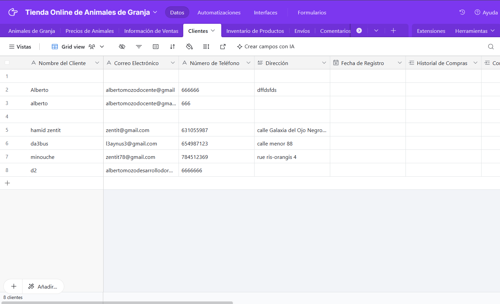

# Mi Granja Inteligente
✅ Objetivo del Proyecto:
Crear una base de datos para administrar los animales de una granja, donde se registren datos clave
como especie, edad, sexo, peso, número de identificación, estado de salud.
🐑 Animales en la Granja:
Vacas 🐄
Ovejas 🐑
Corderos (crías de oveja) 🐑🐣
Gallos 🐓
Gallinas 🐔
Toros 🐃
Conejos 🐇
Pavos 🦃
Cabras 🐐
# 📁 Estructura del Repositorioç
```
granja-digital/
│
├── README.md
├── datos/
│   └── datos_granja.sql
│
├── sql/
│   ├── crear_base_de_datos.sql
│   └── consultas_utiles.sql
│
├── imagenes/
│   └── diagrama_base_datos.png (opcional)
│
└── presentacion/
    └── presentacion_granja.pdf (o PowerPoint, si usas)
```
# 📝 Contenido del README.md
```
# 🐄 Proyecto Escolar: Granja Digital

Este proyecto simula la administración de una **granja digital** con diferentes tipos de animales, utilizando una base de datos creada con **MariaDB/MySQL**.

---

## 📌 Objetivos del Proyecto

- Simular la gestión de animales en una granja.
- Utilizar SQL para organizar y consultar datos.
- Practicar el uso de bases de datos relacionales.
- Presentar resultados de forma clara y ordenada.

---

## 🐑 Animales Incluidos

- Vacas 🐄
- Toros 🐃
- Ovejas 🐑
- Corderos 🐑🐣
- Gallinas 🐔
- Gallos 🐓
- Conejos 🐇
- Pavos 🦃
- Cabras 🐐

---

## 🧱 Estructura de la Base de Datos

```sql
CREATE TABLE animales (
    id INT AUTO_INCREMENT PRIMARY KEY,
    nombre VARCHAR(50),
    tipo_animal VARCHAR(30),
    sexo CHAR(1),
    edad INT,
    peso DECIMAL(6,2),
    estado_salud VARCHAR(30),
    fecha_ingreso DATE,
    observaciones TEXT
);
```
# 💾 Datos Simulados

```
mysql -u root -p granja < datos/datos_granja.sql
```
# 🔍 Consultas Útiles
```
-- Ver todos los animales
SELECT * FROM animales;

-- Contar animales por tipo
SELECT tipo_animal, COUNT(*) FROM animales GROUP BY tipo_animal;

-- Ver animales enfermos
SELECT * FROM animales WHERE estado_salud = 'Enferma';
```
# 🚀 Cómo Ejecutar el Proyecto
Clona el repositorio:
```
git clone https://github.com/ademo/granja-digital.git
cd granja-digital
```
Entra a MySQL y crea la base de datos:
```
SOURCE sql/crear_base_de_datos.sql;
```
Importa los datos:
```
SOURCE datos/datos_granja.sql;
```
# ✍️ Autor
Tarik - Proyecto escolar realizado con fines educativos y de aprendizaje de bases de datos.
```

---

## ✅ Archivos a Subir

### 1. `crear_base_de_datos.sql`
```sql
CREATE DATABASE granja;
USE granja;

CREATE TABLE animales (
    id INT AUTO_INCREMENT PRIMARY KEY,
    nombre VARCHAR(50),
    tipo_animal VARCHAR(30),
    sexo CHAR(1),
    edad INT,
    peso DECIMAL(6,2),
    estado_salud VARCHAR(30),
    fecha_ingreso DATE,
    observaciones TEXT
);
```
 consultas_utiles.sql
 ```
SELECT * FROM animales;
SELECT tipo_animal, COUNT(*) FROM animales GROUP BY tipo_animal;
SELECT * FROM animales WHERE estado_salud = 'Enferma';
SELECT tipo_animal, AVG(peso) FROM animales GROUP BY tipo_animal;
```
# 📄 Documentación de Vistas
🔹 1. vista_animales_enfermos
```
CREATE OR REPLACE VIEW vista_animales_enfermos AS
SELECT *
FROM animales
WHERE estado_salud = 'Enferma';
```
🔹 2. vista_animales_hembra
```
CREATE OR REPLACE VIEW vista_animales_hembra AS
SELECT *
FROM animales
WHERE sexo = 'H';
```
🔹 3. vista_animales_mayores5
```
CREATE OR REPLACE VIEW vista_animales_mayores5 AS
SELECT *
FROM animales
WHERE edad > 5;
```
🔹 4. vista_animales_saludables
```
CREATE OR REPLACE VIEW vista_animales_saludables AS
SELECT *
FROM animales
WHERE estado_salud = 'Saludable';
```
🔹 5. vista_animales_sin_imagen
```
CREATE OR REPLACE VIEW vista_animales_sin_imagen AS
SELECT *
FROM animales
WHERE imagen IS NULL;
```
🔹 6. vista_aves_con_problemas
```
CREATE OR REPLACE VIEW vista_aves_con_problemas AS
SELECT *
FROM animales
WHERE tipo_animal IN ('Gallina', 'Gallo') AND estado_salud <> 'Saludable';
```
🔹 7. vista_bovinos_antiguos
```
CREATE OR REPLACE VIEW vista_bovinos_antiguos AS
SELECT *
FROM animales
WHERE tipo_animal IN ('Toro', 'Vaca') AND fecha_ingreso < '2024-01-01';
```
🔹 8. vista_cabras
```
CREATE OR REPLACE VIEW vista_cabras AS
SELECT *
FROM animales
WHERE tipo_animal = 'Cabra';
```
🔹 9. vista_conejos_jovenes_saludables
```
CREATE OR REPLACE VIEW vista_conejos_jovenes_saludables AS
SELECT *
FROM animales
WHERE tipo_animal = 'Conejo' AND edad < 5 AND estado_salud = 'Saludable';
```
🔹 10. vista_ingresados_2025
```
CREATE OR REPLACE VIEW vista_ingresados_2025 AS
SELECT *
FROM animales
WHERE EXTRACT(YEAR FROM fecha_ingreso) = 2025;
```
# 📸 Evidencia Visual del Proyecto en Airtable
A continuación se presenta una serie de pantallazos que documentan visualmente la configuración actual del proyecto en Airtable. Estas capturas sirven como respaldo gráfico de las estructuras descritas previamente y ayudan a comprender de forma rápida la organización y funcionamiento de la base de datos.
# el inicio

#  automatizacion de trigger

# interface

# datos de granja 


# automatizacion de registro


# Registro de clientes

# 🗃️ 1. Relación entre tablas
```
## 🧩 Relación entre tablas (Modelo Entidad-Relación)

- `animales` ➝ tabla principal con la información de cada animal
- `inventario` ➝ almacena el stock actual por tipo de animal
- `ventas` ➝ registro de ventas realizadas
- `precios` ➝ precios históricos de cada tipo de animal
- `envios` ➝ control de entregas al cliente
- `comentarios_clientes` ➝ opiniones recibidas por cada venta
- `promociones` ➝ descuentos activos según especie o temporada
```
# 📦 2. Scripts incluidos
```
## ⚙️ Scripts incluidos

- `datos_granja.sql`: Inserta los datos de los 100 animales
- `dump_granja.sql`: Exportación completa de la base de datos
- `views.sql`: Contiene las vistas creadas en PostgreSQL para consultas avanzadas
- `airtable_export.csv`: Exportación para cargar datos en Airtable
```
⏱️ 3. Automatizaciones programadas
```
## ⏱️ Automatizaciones

Se creó una automatización en Airtable que:

- Se ejecuta cada día a las 08:00
- Revisa la cantidad disponible
- Activa promociones si hay exceso de stock
- Envía notificación en caso de inventario bajo
```
# 📊 4. Ejemplo de consulta SQL usada
```
## 🔍 Ejemplo de consulta SQL

```sql
-- Obtener animales con menos de 2 unidades disponibles
SELECT a.nombre, i.cantidad_disponible
FROM animales a
JOIN inventario i ON a.id = i.animal_id
WHERE i.cantidad_disponible < 2;
```
---

## 🧾 Conclusión

Este proyecto fue una excelente oportunidad para aplicar conocimientos de bases de datos, automatización y visualización de información. A través de la simulación de una granja, logré construir un sistema completo que incluye la gestión de animales, inventario, precios, ventas y más, utilizando herramientas reales del mundo profesional como MariaDB, PostgreSQL, DBeaver y Airtable.

Este trabajo no solo refleja habilidades técnicas, sino también organización, planificación y visión de proyecto. Estoy orgulloso del resultado y abierto a seguir mejorándolo en el futuro.

Gracias por visitar este repositorio 🐄✨

---


